

  <h1 style="color: #FFF;">DATA PROJECTS</h1>

<table>
</td>
</tr>
<tr>
<td>

### Market Basket Analysis 
Overview: Market Basket Analysis project based on "The Bread Basket" dataset to identify purchasing patterns and generate actionable insights using association rules.

**Technologies Used**: Python, Pandas, Seaborn, mlxtend, Pyvis.

[View Project's Files](https://github.com/sitshayeva/portfolio/tree/main/projects/43)  

<td>

### PySpark Diabetes Prediction ML Project
Overview: Diabetes Prediction ML Project using PySpark.
Technologies Used: PySpark.
[View Project's Files](https://github.com/sitshayeva/portfolio/tree/main/projects/42)
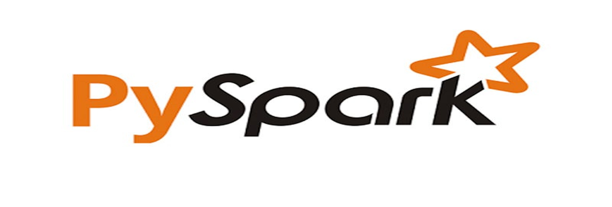

<td>

### iTunes Podcast Reviews Dashboards Tableau
Overview: Visualization of iTunes podcast reviews using interactive dashboards.
Technologies Used: Tableau.
[View Project's Files](https://github.com/sitshayeva/portfolio/tree/main/projects/41)
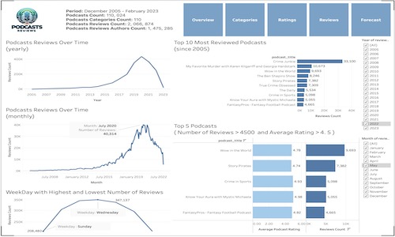

</td>
<td>

### Customer K-means clustering in Python
Overview: Clustering customer data to identify distinct groups for targeted marketing.
Technologies Used: Python, K-means clustering algorithm.
[View Project's Files](https://github.com/sitshayeva/portfolio/tree/main/projects/30)
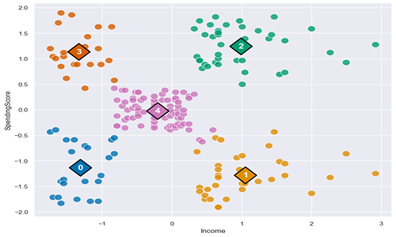

</td>
</tr>
<tr>
<td>

### Machine Learning: Decision Tree with KNIME
Overview: Using decision trees for predictive modeling in KNIME.
Technologies Used: KNIME.
[View Project's Files](https://github.com/sitshayeva/portfolio/tree/main/projects/31)
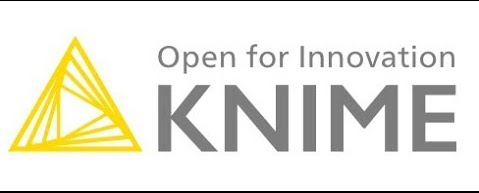 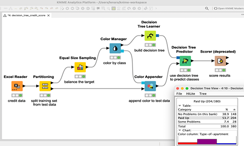

</td>
<td>

### NLP Challenge: IMDB Dataset of 50K Movie Reviews to perform Sentiment Analysis
Overview: Analyzing a large dataset of movie reviews to determine sentiment trends using NLP techniques.
Technologies Used: Python, Natural Language Processing.
[View Project's Files](https://github.com/sitshayeva/portfolio/tree/main/projects/32)
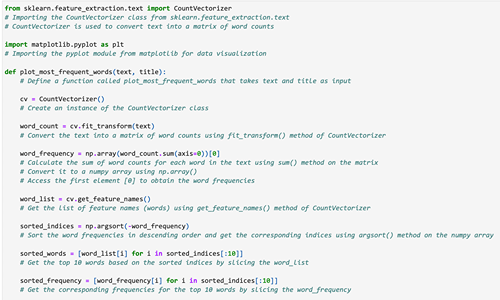

</td>
<td>

### Recommendation System. Collaborative Filtering
Overview: Building a collaborative filtering system to recommend products to users based on similar user preferences.
Technologies Used: Python, Machine Learning.
[View Project's Files](https://github.com/sitshayeva/portfolio/tree/main/projects/35)
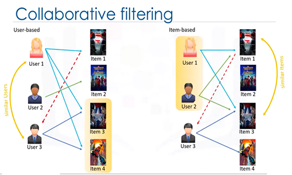

</td>
<td>

### Book Recommendation Model. K-Nearest Neighbors
Overview: Utilizing the K-Nearest Neighbors algorithm to create a book recommendation system.
Technologies Used: Python, K-Nearest Neighbors.
[View Project's Files](https://github.com/sitshayeva/portfolio/tree/main/projects/37)
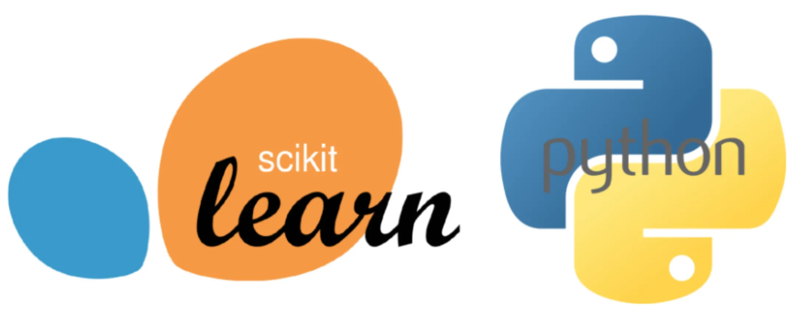

</td>
</tr>
</table>

<table>
<tr>
<td>

### Amazon Customer Reviews Sentiment Analysis
Overview: Performing sentiment analysis on Amazon customer reviews to gauge consumer satisfaction.
Technologies Used: Python, Natural Language Processing.
[View Project's Files](https://github.com/sitshayeva/portfolio/tree/main/projects/33)
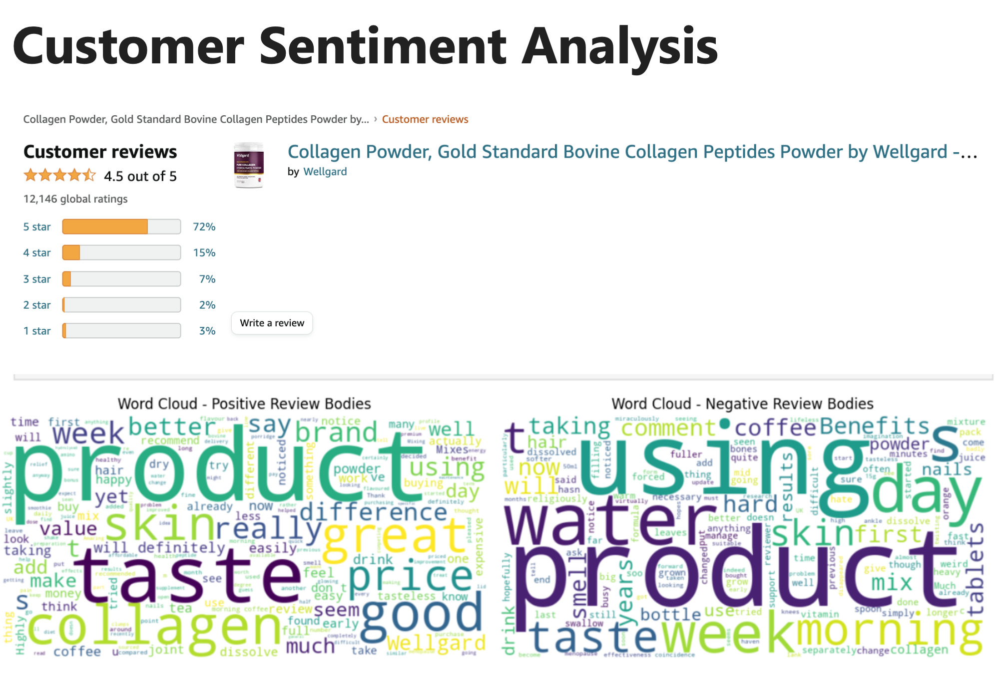

</td>
<td>

### Image Classifier using TensorFlow. Keras
Overview: Building an image classification model using TensorFlow and Keras.
Technologies Used: TensorFlow, Keras.
[View Project's Files](https://github.com/sitshayeva/portfolio/tree/main/projects/36)
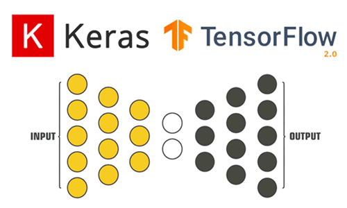

</td>
<td>

### Linear Regression Health Costs Calculator
Overview: Creating a health costs prediction model using linear regression.
Technologies Used: Python, Linear Regression.
[View Project's Files](https://github.com/sitshayeva/portfolio/tree/main/projects/38)
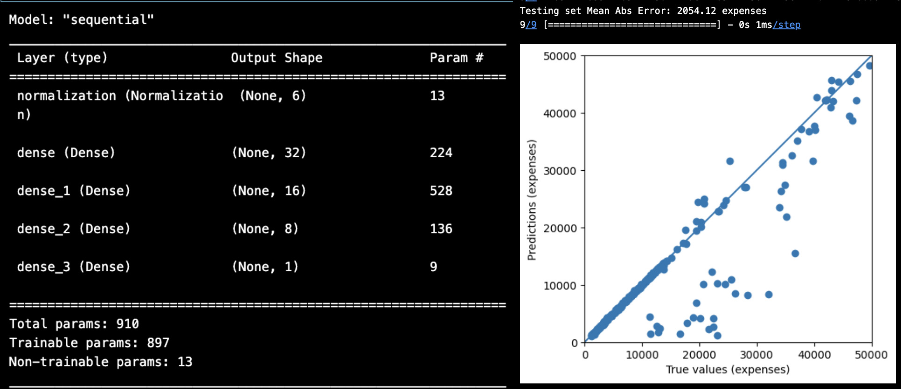

</td>
</tr>
<tr>
<td>

### Neural Network SMS Text Classifier
Overview: Developing a text classification system using neural networks to categorize SMS messages.
Technologies Used: Python, Neural Networks.
[View Project's Files](https://github.com/sitshayeva/portfolio/tree/main/projects/39)
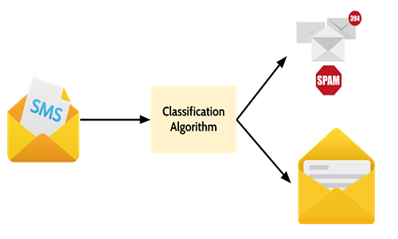

</td>
<td>

### Sentiment Analysis of Yelp Business Reviews
Overview: Analyzing Yelp reviews to extract business insights through sentiment analysis.
Technologies Used: Python, Natural Language Processing.
[View Project's Files](https://github.com/sitshayeva/portfolio/tree/main/projects/15)
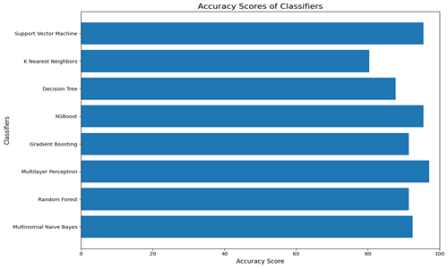

</td>
<td>

### Using Streamlit for Data Visualisation
Overview: Developing interactive data visualizations using Streamlit to enable dynamic user interactions.
Technologies Used: Streamlit, Python.
[View Project's Files](https://github.com/sitshayeva/portfolio/tree/main/projects/18)
 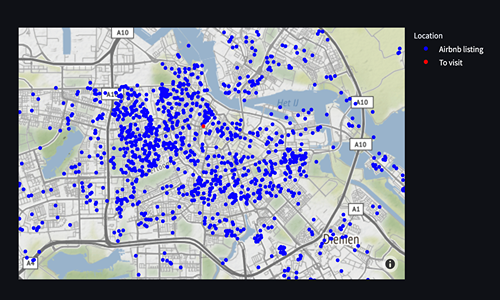

</td>
</tr>
<tr>
<td>

### WEB scraping and Sentiment Analysis British Airways Customer Reviews
Overview: Extracting and analyzing sentiment from British Airways customer reviews through web scraping.
Technologies Used: Python, Web Scraping, Natural Language Processing.
[View Project's Files](https://github.com/sitshayeva/portfolio/tree/main/projects/24)
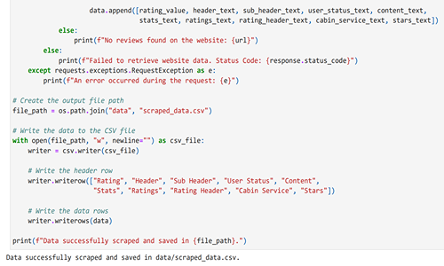 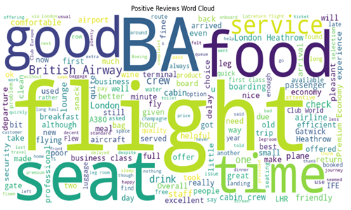

</td>
<td>

### Creating Dynamic Filters in Streamlit
Overview: Building a Streamlit application that incorporates dynamic filters for data manipulation.
Technologies Used: Streamlit, Python.
[View Project's Files](https://github.com/sitshayeva/portfolio/tree/main/projects/19)
 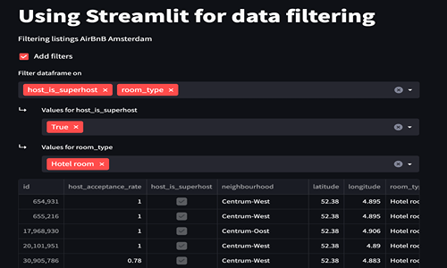

</td>
<td>

### Predicting Customer Behaviour British Airways
Overview: Using data analysis and machine learning to predict customer behavior for British Airways.
Technologies Used: Python, Machine Learning Algorithms.
[View Project's Files](https://github.com/sitshayeva/portfolio/tree/main/projects/25)
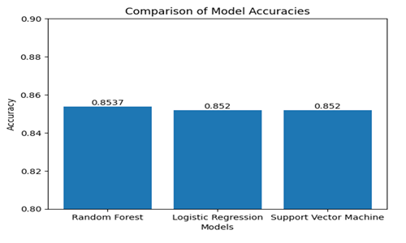 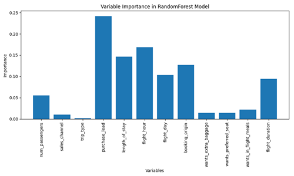

</td>
</tr>
</table>

<table>
<tr>
<td>

### Kaggle Housing Prices Competition
Overview: Participating in the Kaggle competition to predict housing prices based on various features.
Technologies Used: Python, Machine Learning, Regression Analysis.
[View Project's Files](https://github.com/sitshayeva/portfolio/tree/main/projects/28)
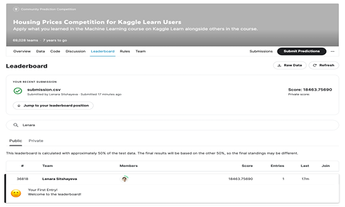

</td>
<td>

### Kaggle Store Sales - Time Series Forecasting
Overview: Forecasting store sales using time series analysis in a Kaggle competition.
Technologies Used: Python, Time Series Analysis, Machine Learning.
[View Project's Files](https://github.com/sitshayeva/portfolio/tree/main/projects/34)
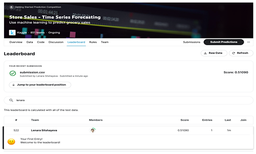

</td>
<td>

### Supervised ML: Regression Tree in Python
Overview: Implementing a regression tree to predict outcomes based on a set of input variables.
Technologies Used: Python, Decision Trees.
[View Project's Files](https://github.com/sitshayeva/portfolio/tree/main/projects/29)
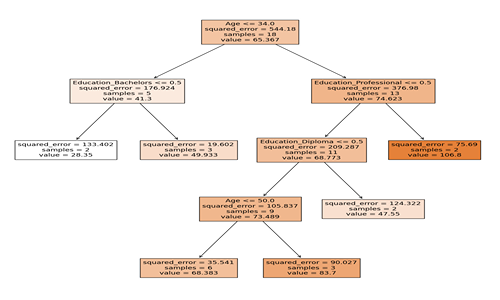

</td>
</tr>
<tr>
<td>

### Machine Learning Analysis in Retail
Overview: Analyzing retail data using machine learning to optimize inventory and sales strategies.
Technologies Used: Python, Machine Learning.
[View Project's Files](https://github.com/sitshayeva/portfolio/tree/main/projects/21)

</td>
<td>

### Credit Card Fraud Detection using Scikit-Learn and Snap ML
Overview: Developing a model to detect fraudulent transactions using machine learning.
Technologies Used: Python, Scikit-Learn, Snap ML.
[View Project's Files](https://github.com/sitshayeva/portfolio/tree/main/projects/22)
 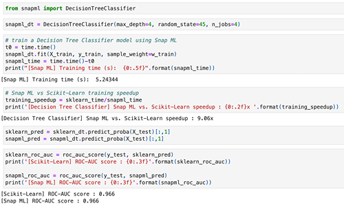

</td>
<td>

### Natural Language Processing with Hugging Face Transformers
Overview: Leveraging Hugging Face Transformers for advanced natural language processing tasks.
Technologies Used: Python, Hugging Face Transformers.
[View Project's Files](https://github.com/sitshayeva/portfolio/tree/main/projects/23)
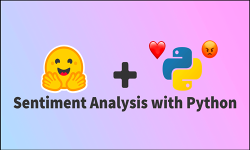 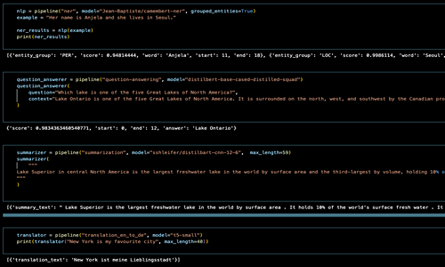

</td>
</tr>
<tr>
<td>

### Auto Exploratory Data Analysis with D-Tale, SweetViz, Pandas Profiling
Overview: Automating the exploratory data analysis process using various Python libraries.
Technologies Used: Python, D-Tale, SweetViz, Pandas Profiling.
[View Project's Files](https://github.com/sitshayeva/portfolio/tree/main/projects/26)
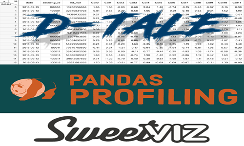

</td>
<td>

### Auto ML and Bespoke ML with sklearn (Random Forest, Logistic Regression, SVC)
Overview: Implementing both automated and custom machine learning solutions using Scikit-Learn.
Technologies Used: Python, Scikit-Learn.
[View Project's Files](https://github.com/sitshayeva/portfolio/tree/main/projects/27)
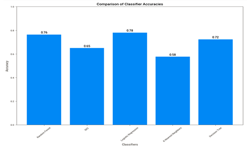

</td>
<td>

### Assess the Quality of a Dataset for a Public Service Agency
Overview: Evaluating and improving the quality of a dataset used by a public service agency.
Technologies Used: Data Quality Assessment.
[View Project's Files](https://github.com/sitshayeva/portfolio/tree/main/projects/4)
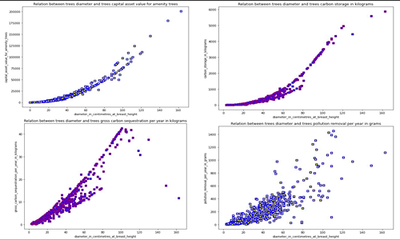

</td>
</tr>
</table>

<table>
<tr>
<td>

### Data Transformation Pipeline with Cloud Dataprep (Alteryx)
Overview: Designing and implementing a data transformation pipeline using Cloud Dataprep similar to Alteryx.
Technologies Used: Cloud Dataprep, Alteryx.
[View Project's Files](https://github.com/sitshayeva/portfolio/tree/main/projects/40)
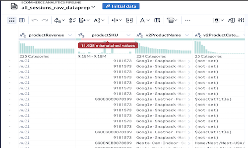

</td>
<td>

### Correlation in Python
Overview: Exploring statistical correlations within datasets using Python.
Technologies Used: Python, Statistical Analysis.
[View Project's Files](https://github.com/sitshayeva/portfolio/tree/main/projects/20)
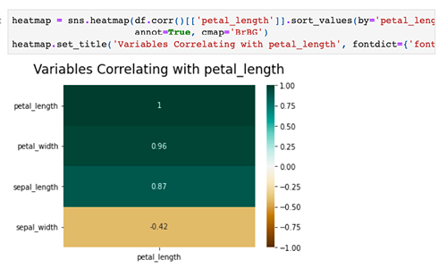

</td>
<td>

### Explore Data Using SQL in Google Colab
Overview: Conducting data exploration and analysis using SQL within the Google Colab environment.
Technologies Used: SQL, Google Colab.
[View Project's Files](https://github.com/sitshayeva/portfolio/tree/main/projects/17)
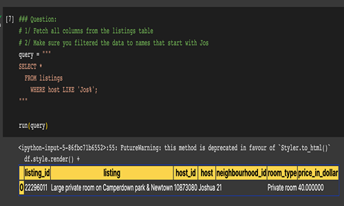

</td>
</tr>
<tr>
<td>

### SQL Sub-queries in Google Colab
Overview: Demonstrating the use of SQL sub-queries for complex data queries in Google Colab.
Technologies Used: SQL, Google Colab.
[View Project's Files](https://github.com/sitshayeva/portfolio/tree/main/projects/16)
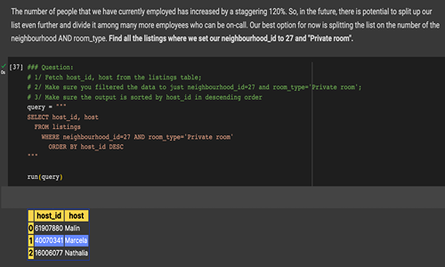

</td>
<td>

### Create a Dashboard Meeting Business Requirements
Overview: Developing a customized dashboard to meet specific business analysis needs.
Technologies Used: Dashboard Design, Business Analysis.
[View Project's Files](https://github.com/sitshayeva/portfolio/tree/main/projects/6)
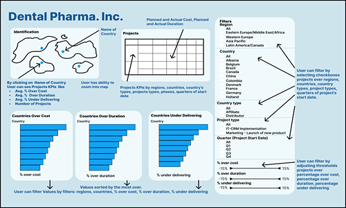

</td>
<td>

### Retrieve User Activity Data on an Online Forum Using SQL
Overview: Extracting and analyzing user activity data from an online forum using SQL.
Technologies Used: SQL, Data Analysis.
[View Project's Files](https://github.com/sitshayeva/portfolio/tree/main/projects/7)
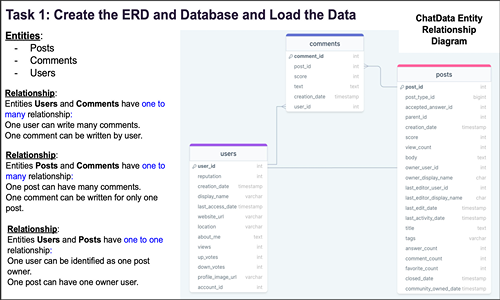

</td>
</tr>
<tr>
<td>

### Working with Web APIs and JSON on Movies Dataset
Overview: Utilizing web APIs to fetch and process movie data stored in JSON format.
Technologies Used: Web APIs, JSON, Python.
[View Project's Files](https://github.com/sitshayeva/portfolio/tree/main/projects/2)
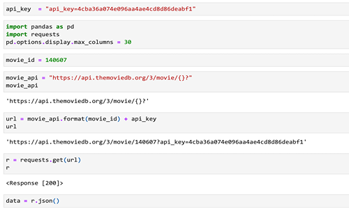

</td>
<td>

### Explore a Dataset on Energy Usage and Draw First Conclusions
Overview: Analyzing an energy usage dataset to uncover patterns and draw initial conclusions.
Technologies Used: Data Analysis, Visualization Techniques.
[View Project's Files](https://github.com/sitshayeva/portfolio/tree/main/projects/5)
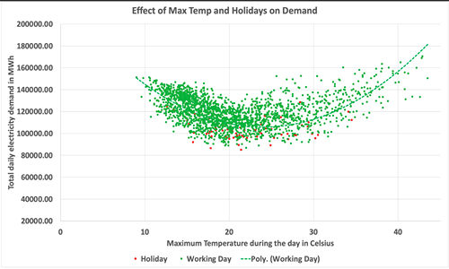

</td>
<td>

### Create a Web Server and an Amazon RDS DB Instance
Overview: Setting up a web server connected to an Amazon RDS database for handling dynamic web applications.
Technologies Used: Web Server Management, Amazon RDS.
[View Project's Files](https://github.com/sitshayeva/portfolio/tree/main/projects/3)
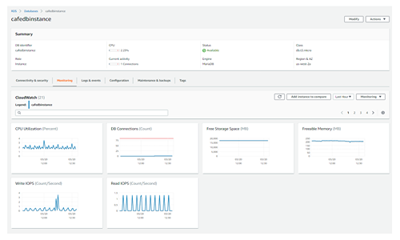

</td>
</tr>
<tr>
<td>

### Data Analysis using Pandas and SQLite3
Overview: Conducting comprehensive data analysis using Pandas in conjunction with SQLite3 for database management.
Technologies Used: Pandas, SQLite3, Python.
[View Project's Files](https://github.com/sitshayeva/portfolio/tree/main/projects/14)
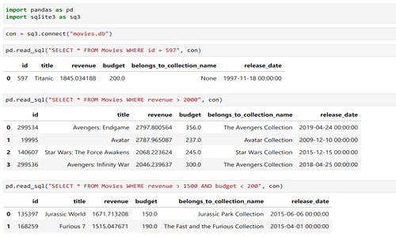

</td>
<td>

### E-commerce Store Sales Analysis
Overview: Analyzing sales data from an e-commerce platform to optimize marketing and sales strategies.
Technologies Used: Data Analysis, Business Intelligence.
[View Project's Files](https://github.com/sitshayeva/portfolio/tree/main/projects/8)
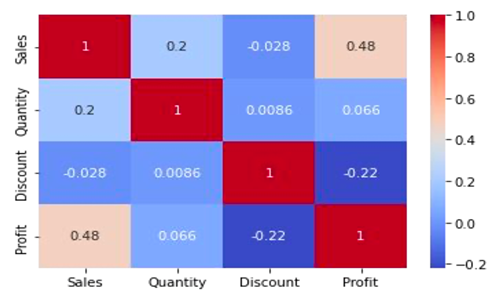

</td>
<td>

### Exploratory Data Analysis on Diamonds Dataset
Overview: Performing exploratory data analysis on a dataset of diamonds to understand pricing factors.
Technologies Used: Data Visualization, Statistical Analysis.
[View Project's Files](https://github.com/sitshayeva/portfolio/tree/main/projects/9)
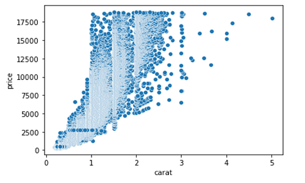

</td>
</tr>
<tr>
<td>

### Data Cleaning, Transformation, and Visualisation on AirBnB London Dataset
Overview: Cleaning, transforming, and visualizing data from the AirBnB London dataset to derive actionable insights.
Technologies Used: Data Cleaning, Data Transformation, Data Visualization.
[View Project's Files](https://github.com/sitshayeva/portfolio/tree/main/projects/12)

</td>
<td>

### Data Cleaning on Movies Dataset
Overview: Performing data cleaning on a comprehensive movies dataset to prepare for further analysis.
Technologies Used: Data Cleaning, Python.
[View Project's Files](https://github.com/sitshayeva/portfolio/tree/main/projects/10)
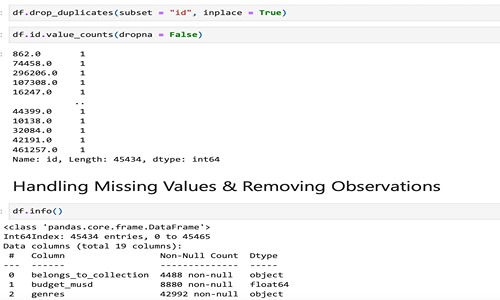

</td>
<td>

### Short-Term Rental Analytics on AirBnB Bristol Dataset
Overview: Analyzing short-term rental data from Airbnb in Bristol to understand market trends and rental dynamics.
Technologies Used: Data Analysis, Business Intelligence.
[View Project's Files](https://github.com/sitshayeva/portfolio/tree/main/projects/11)
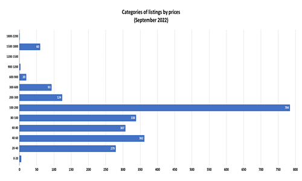

</td>
</tr>
<tr>
<td>

### Data Cleaning, Merging, Transforming on Movies Dataset
Overview: Enhancing a movies dataset by cleaning, merging, and transforming data to support detailed analysis.
Technologies Used: Data Cleaning, Data Merging, Data Transformation.
[View Project's Files](https://github.com/sitshayeva/portfolio/tree/main/projects/13)
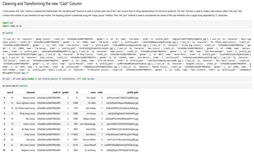

</td>
<td>

### Exploratory Data Analysis on Movies Dataset
Overview: Conducting exploratory data analysis on a movies dataset to uncover trends and insights.
Technologies Used: Data Analysis, Visualization.
[View Project's Files](https://github.com/sitshayeva/portfolio/tree/main/projects/1)
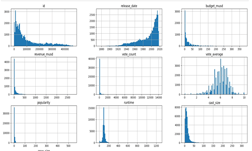

</td>
<td>
</table>
