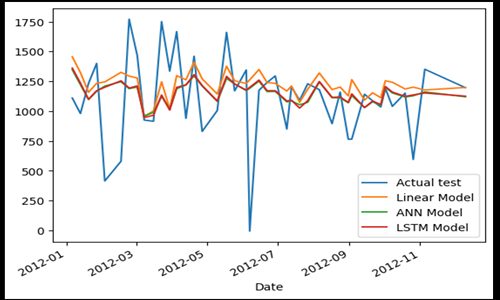

  <h1 style="color: #FFF;">DATA PROJECTS</h1>

<table>
<tr>
<td>

### Indicators of Heavy Traffic on I-94: Enhanced Analysis with Interactive Dashboard

Overview: Determine an indicator of heavy traffic on I-94

**Technologies Used**: Python, Pandas, Matplotlib.

[View Project's Files](https://github.com/sitshayeva/portfolio/tree/main/projects/53)  

</td>
<td>

### EUR Exchange Rate Trends & Volatility Analysis (1999-2021)
Overview: Analyze historical EUR exchange rates from 1999 to 2021, focusing on key economic events. 

**Technologies Used**: Python, Pandas, MatplotLib, Seaborn.

[View Project's Files](https://github.com/sitshayeva/portfolio/tree/main/projects/54)  

</td>
<td>

### London Weather Forecasting with Prophet, Requests (Open-Meteo API)

Overview: This project **retrieves, processes, and forecasts** daily average temperatures for the last 5 years using **Prophet**. 
The model accounts for **seasonality, trends, and irregular variations** to provide reliable weather predictions.

**Technologies Used**: Prophet, Matplotlib & Pandas, API Requests, SQLite3.

[View Project's Files](https://github.com/sitshayeva/portfolio/tree/main/projects/52)  

</td>
</tr>

<tr>
<td>

### UK Online Retail Data Quality Validation Project (GX)
Overview: Ensure the dataset's accuracy, consistency, and reliability by applying a series of data validation checks using Great Expectations

**Technologies Used**: Python, Pandas, Great Expectations.

[View Project's Files](https://github.com/sitshayeva/portfolio/tree/main/projects/51)  

  
</td>
<td>

### Toy Store KPI Report
Overview: Build a simple, interactive KPI report to track key metrics and explore high-level trends

**Technologies Used**: Python, Pandas, MatplotLib, Seaborn.

[View Project's Files](https://github.com/sitshayeva/portfolio/tree/main/projects/47)  

</td>
<td>

### Global CO2 Emissions Interactive Dashboard

Overview: Create an interactive dashboard exploring CO2 emissions, energy consumption, and carbon intensity trends globally and by country over 250 years.

**Technologies Used**: Python, Pandas, PyGWalker, Matplotlib.

[View Project's Files](https://github.com/sitshayeva/portfolio/tree/main/projects/52)  

</td>
</tr>

<tr>
<td>

### LEGO Set Explorer

Overview: Build a custom, interactive tool to help users discover the perfect LEGO set

**Technologies Used**: Python, Pandas, MatplotLib, Seaborn.

[View Project's Files](https://github.com/sitshayeva/portfolio/tree/main/projects/48)  

  
</td>
<td>

### Coffee Shop Dashboard
Overview: Build an interactive dashboard to explore and analyze coffee shop sales

**Technologies Used**: Python, Pandas, MatplotLib, Seaborn.

[View Project's Files](https://github.com/sitshayeva/portfolio/tree/main/projects/49)  

  
</td>
<td>

### Global CO2 Emissions
Overview: Create an interactive dashboard showcasing 250 years of CO2 emissions data

**Technologies Used**: Python, Pandas, MatplotLib, Seaborn.

[View Project's Files](https://github.com/sitshayeva/portfolio/tree/main/projects/50)  

</td>
</tr>

<tr>
<td>

### AirBnB Listing Analysis
Overview: Analyze AirBnB listings in Paris to determine the impact of recent regulations

**Technologies Used**: Python, Pandas, MatplotLib, Seaborn.

[View Project's Files](https://github.com/sitshayeva/portfolio/tree/main/projects/44)  

  
</td>
<td>

### Restaurant Order Analysis
Overview: Analyze order data to identify the most and least popular menu items and types of cuisine

**Technologies Used**: Python, Pandas, MatplotLib, Seaborn.

[View Project's Files](https://github.com/sitshayeva/portfolio/tree/main/projects/45)  

  
</td>
<td>

### CRM Sales Dashboard
Overview: Build an interactive dashboard for Sales Managers to track their team's quarterly performance  
**Technologies Used**: Python, Pandas, Seaborn.

[View Project's Files](https://github.com/sitshayeva/portfolio/tree/main/projects/46)  

<tr>
<td>

### Market Basket Analysis
Overview: Market Basket Analysis project based on "The Bread Basket" dataset to identify purchasing patterns and generate actionable insights using association rules.

**Technologies Used**: Python, Pandas, Seaborn, mlxtend, Pyvis.

[View Project's Files](https://github.com/sitshayeva/portfolio/tree/main/projects/43)  

</td>
<td>

### PySpark Diabetes Prediction ML Project
Overview: Diabetes Prediction ML Project using PySpark.

**Technologies Used**: PySpark.

[View Project's Files](https://github.com/sitshayeva/portfolio/tree/main/projects/42)  

</td>
<td>

### iTunes Podcast Reviews Dashboards Tableau
Overview: Visualization of iTunes podcast reviews using interactive dashboards.

**Technologies Used**: Tableau.

[View Project's Files](https://github.com/sitshayeva/portfolio/tree/main/projects/41)  

</td>
</tr>
<tr>
<td>

  <h1 style="color: #FFF;">DATA PROJECTS</h1>

<table>
<tr>
<td>

### Customer K-means clustering in Python
Overview: Clustering customer data to identify distinct groups for targeted marketing.

**Technologies Used**: Python, K-means clustering algorithm.

[View Project's Files](https://github.com/sitshayeva/portfolio/tree/main/projects/30)  

</td>
<td>

### Machine Learning: Decision Tree with KNIME
Overview: Using decision trees for predictive modeling in KNIME.

**Technologies Used**: KNIME.

[View Project's Files](https://github.com/sitshayeva/portfolio/tree/main/projects/31)  
 

</td>
<td>

### NLP Challenge: IMDB Dataset of 50K Movie Reviews to perform Sentiment Analysis
Overview: Analyzing a large dataset of movie reviews to determine sentiment trends using NLP techniques.

**Technologies Used**: Python, Natural Language Processing.

[View Project's Files](https://github.com/sitshayeva/portfolio/tree/main/projects/32)  

</td>
</tr>
<tr>
<td>

### Recommendation System. Collaborative Filtering
Overview: Building a collaborative filtering system to recommend products to users based on similar user preferences.

**Technologies Used**: Python, Machine Learning.

[View Project's Files](https://github.com/sitshayeva/portfolio/tree/main/projects/35)  

</td>
<td>

### Book Recommendation Model. K-Nearest Neighbors
Overview: Utilizing the K-Nearest Neighbors algorithm to create a book recommendation system.

**Technologies Used**: Python, K-Nearest Neighbors.

[View Project's Files](https://github.com/sitshayeva/portfolio/tree/main/projects/37)  

</td>
<td>

### Amazon Customer Reviews Sentiment Analysis
Overview: Performing sentiment analysis on Amazon customer reviews to gauge consumer satisfaction.

**Technologies Used**: Python, Natural Language Processing.

[View Project's Files](https://github.com/sitshayeva/portfolio/tree/main/projects/33)  

</td>
</tr>
<tr>
<td>

### Image Classifier using TensorFlow. Keras
Overview: Building an image classification model using TensorFlow and Keras.

**Technologies Used**: TensorFlow, Keras.

[View Project's Files](https://github.com/sitshayeva/portfolio/tree/main/projects/36)  

</td>
<td>

### Linear Regression Health Costs Calculator
Overview: Creating a health costs prediction model using linear regression.

**Technologies Used**: Python, Linear Regression.

[View Project's Files](https://github.com/sitshayeva/portfolio/tree/main/projects/38)  

</td>
<td>

### Neural Network SMS Text Classifier
Overview: Developing a text classification system using neural networks to categorize SMS messages.

**Technologies Used**: Python, Neural Networks.

[View Project's Files](https://github.com/sitshayeva/portfolio/tree/main/projects/39)  

</td>
</tr>
</table>

<table>
<tr>
<td>

### Sentiment Analysis of Yelp Business Reviews
Overview: Analyzing Yelp reviews to extract business insights through sentiment analysis.

**Technologies Used**: Python, Natural Language Processing.

[View Project's Files](https://github.com/sitshayeva/portfolio/tree/main/projects/15)  

</td>
<td>

### Using Streamlit for Data Visualisation
Overview: Developing interactive data visualizations using Streamlit to enable dynamic user interactions.

**Technologies Used**: Streamlit, Python.

[View Project's Files](https://github.com/sitshayeva/portfolio/tree/main/projects/18)  
 

</td>
<td>

### WEB scraping and Sentiment Analysis British Airways Customer Reviews
Overview: Extracting and analyzing sentiment from British Airways customer reviews through web scraping.

**Technologies Used**: Python, Web Scraping, Natural Language Processing.

[View Project's Files](https://github.com/sitshayeva/portfolio/tree/main/projects/24)  
 

</td>
</tr>
<tr>
<td>

### Creating Dynamic Filters in Streamlit
Overview: Building a Streamlit application that incorporates dynamic filters for data manipulation.

**Technologies Used**: Streamlit, Python.

[View Project's Files](https://github.com/sitshayeva/portfolio/tree/main/projects/19)  
 

</td>
<td>

### Predicting Customer Behaviour British Airways
Overview: Using data analysis and machine learning to predict customer behavior for British Airways.

**Technologies Used**: Python, Machine Learning Algorithms.

[View Project's Files](https://github.com/sitshayeva/portfolio/tree/main/projects/25)  
 

</td>
<td>

### Kaggle Housing Prices Competition
Overview: Participating in the Kaggle competition to predict housing prices based on various features.

**Technologies Used**: Python, Machine Learning, Regression Analysis.

[View Project's Files](https://github.com/sitshayeva/portfolio/tree/main/projects/28)  

</td>
</tr>
<tr>
<td>

### Kaggle Store Sales - Time Series Forecasting
Overview: Forecasting store sales using time series analysis in a Kaggle competition.

**Technologies Used**: Python, Time Series Analysis, Machine Learning.

[View Project's Files](https://github.com/sitshayeva/portfolio/tree/main/projects/34)  

</td>
<td>

### Supervised ML: Regression Tree in Python
Overview: Implementing a regression tree to predict outcomes based on a set of input variables.

**Technologies Used**: Python, Decision Trees.

[View Project's Files](https://github.com/sitshayeva/portfolio/tree/main/projects/29)  

</td>
<td>

### Machine Learning Analysis in Retail
Overview: Analyzing retail data using machine learning to optimize inventory and sales strategies.

**Technologies Used**: Python, Machine Learning.

[View Project's Files](https://github.com/sitshayeva/portfolio/tree/main/projects/21)  

</td>
</tr>
<tr>
<td>

### Credit Card Fraud Detection using Scikit-Learn and Snap ML
Overview: Developing a model to detect fraudulent transactions using machine learning.

**Technologies Used**: Python, Scikit-Learn, Snap ML.

[View Project's Files](https://github.com/sitshayeva/portfolio/tree/main/projects/22)  
 

</td>
<td>

### Natural Language Processing with Hugging Face Transformers
Overview: Leveraging Hugging Face Transformers for advanced natural language processing tasks.

**Technologies Used**: Python, Hugging Face Transformers.

[View Project's Files](https://github.com/sitshayeva/portfolio/tree/main/projects/23)  
 

</td>
<td>
  

  <h1 style="color: #FFF;">DATA PROJECTS</h1>

<table>
<tr>
<td>

### Auto Exploratory Data Analysis with D-Tale, SweetViz, Pandas Profiling
Overview: Automating the exploratory data analysis process using various Python libraries.

**Technologies Used**: Python, D-Tale, SweetViz, Pandas Profiling.

[View Project's Files](https://github.com/sitshayeva/portfolio/tree/main/projects/26)  

</td>
</tr>
<tr>
<td>

### Auto ML and Bespoke ML with sklearn (Random Forest, Logistic Regression, SVC)
Overview: Implementing both automated and custom machine learning solutions using Scikit-Learn.

**Technologies Used**: Python, Scikit-Learn.

[View Project's Files](https://github.com/sitshayeva/portfolio/tree/main/projects/27)  

</td>
<td>

### Assess the Quality of a Dataset for a Public Service Agency
Overview: Evaluating and improving the quality of a dataset used by a public service agency.

**Technologies Used**: Data Quality Assessment.

[View Project's Files](https://github.com/sitshayeva/portfolio/tree/main/projects/4)  

</td>
<td>

### Data Transformation Pipeline with Cloud Dataprep (Alteryx)
Overview: Designing and implementing a data transformation pipeline using Cloud Dataprep similar to Alteryx.

**Technologies Used**: Cloud Dataprep, Alteryx.

[View Project's Files](https://github.com/sitshayeva/portfolio/tree/main/projects/40)  

</td>
</tr>
</table>

<table>
<tr>
<td>

### Correlation in Python
Overview: Exploring statistical correlations within datasets using Python.

**Technologies Used**: Python, Statistical Analysis.

[View Project's Files](https://github.com/sitshayeva/portfolio/tree/main/projects/20)  

</td>
<td>

### Explore Data Using SQL in Google Colab
Overview: Conducting data exploration and analysis using SQL within the Google Colab environment.

**Technologies Used**: SQL, Google Colab.

[View Project's Files](https://github.com/sitshayeva/portfolio/tree/main/projects/17)  

</td>
<td>

### SQL Sub-queries in Google Colab
Overview: Demonstrating the use of SQL sub-queries for complex data queries in Google Colab.

**Technologies Used**: SQL, Google Colab.

[View Project's Files](https://github.com/sitshayeva/portfolio/tree/main/projects/16)  

</td>
</tr>
<tr>
<td>

### Create a Dashboard Meeting Business Requirements
Overview: Developing a customized dashboard to meet specific business analysis needs.

**Technologies Used**: Dashboard Design, Business Analysis.

[View Project's Files](https://github.com/sitshayeva/portfolio/tree/main/projects/6)  

</td>
<td>

### Retrieve User Activity Data on an Online Forum Using SQL
Overview: Extracting and analyzing user activity data from an online forum using SQL.

**Technologies Used**: SQL, Data Analysis.

[View Project's Files](https://github.com/sitshayeva/portfolio/tree/main/projects/7)  

</td>
<td>

### Working with Web APIs and JSON on Movies Dataset
Overview: Utilizing web APIs to fetch and process movie data stored in JSON format.

**Technologies Used**: Web APIs, JSON, Python.

[View Project's Files](https://github.com/sitshayeva/portfolio/tree/main/projects/2)  

</td>
</tr>
<tr>
<td>

### Explore a Dataset on Energy Usage and Draw First Conclusions
Overview: Analyzing an energy usage dataset to uncover patterns and draw initial conclusions.

**Technologies Used**: Data Analysis, Visualization Techniques.

[View Project's Files](https://github.com/sitshayeva/portfolio/tree/main/projects/5)  

</td>
<td>

### Create a Web Server and an Amazon RDS DB Instance
Overview: Setting up a web server connected to an Amazon RDS database for handling dynamic web applications.

**Technologies Used**: Web Server Management, Amazon RDS.

[View Project's Files](https://github.com/sitshayeva/portfolio/tree/main/projects/3)  

</td>
<td>

### Data Analysis using Pandas and SQLite3
Overview: Conducting comprehensive data analysis using Pandas in conjunction with SQLite3 for database management.

**Technologies Used**: Pandas, SQLite3, Python.

[View Project's Files](https://github.com/sitshayeva/portfolio/tree/main/projects/14)  

</td>
</tr>
<tr>
<td>

### E-commerce Store Sales Analysis
Overview: Analyzing sales data from an e-commerce platform to optimize marketing and sales strategies.

**Technologies Used**: Data Analysis, Business Intelligence.

[View Project's Files](https://github.com/sitshayeva/portfolio/tree/main/projects/8)  

</td>
<td>

### Exploratory Data Analysis on Diamonds Dataset
Overview: Performing exploratory data analysis on a dataset of diamonds to understand pricing factors.

**Technologies Used**: Data Visualization, Statistical Analysis.

[View Project's Files](https://github.com/sitshayeva/portfolio/tree/main/projects/9)  

</td>
<td>

### Data Cleaning, Transformation, and Visualisation on AirBnB London Dataset
Overview: Cleaning, transforming, and visualizing data from the AirBnB London dataset to derive actionable insights.

**Technologies Used**: Data Cleaning, Data Transformation, Data Visualization.

[View Project's Files](https://github.com/sitshayeva/portfolio/tree/main/projects/12)  

</td>
</tr>
<tr>
<td>

### Data Cleaning on Movies Dataset
Overview: Performing data cleaning on a comprehensive movies dataset to prepare for further analysis.

**Technologies Used**: Data Cleaning, Python.

[View Project's Files](https://github.com/sitshayeva/portfolio/tree/main/projects/10)  

</td>
<td>

### Short-Term Rental Analytics on AirBnB Bristol Dataset
Overview: Analyzing short-term rental data from Airbnb in Bristol to understand market trends and rental dynamics.

**Technologies Used**: Data Analysis, Business Intelligence.

[View Project's Files](https://github.com/sitshayeva/portfolio/tree/main/projects/11)  

</td>
<td>

### Data Cleaning, Merging, Transforming on Movies Dataset
Overview: Enhancing a movies dataset by cleaning, merging, and transforming data to support detailed analysis.

**Technologies Used**: Data Cleaning, Data Merging, Data Transformation.

[View Project's Files](https://github.com/sitshayeva/portfolio/tree/main/projects/13)  

</td>
</tr>
<tr>
<td>

### Exploratory Data Analysis on Movies Dataset
Overview: Conducting exploratory data analysis on a movies dataset to uncover trends and insights.

**Technologies Used**: Data Analysis, Visualization.

[View Project's Files](https://github.com/sitshayeva/portfolio/tree/main/projects/1)  

</td>
</tr>
</table>
