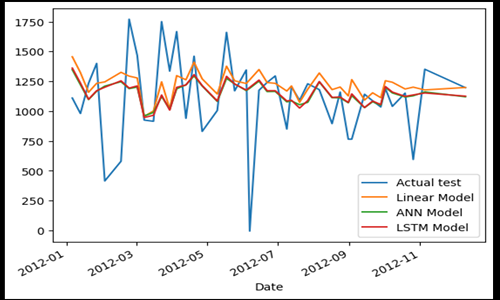
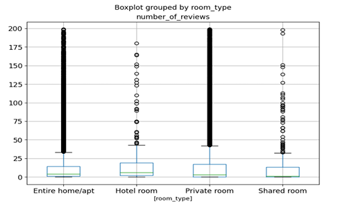

                                             

  <h1 style="color: #FFF;"> DATA PROJECTS </h1>

## Customer K-means clustering in Python

[View Project's Files](https://github.com/sitshayeva/portfolio/tree/main/projects/30)

## Machine Learning: Decision Tree with KNIME

[View Project's Files](https://github.com/sitshayeva/portfolio/tree/main/projects/31)

## NLP Challenge: IMDB Dataset of 50K Movie Reviews to perform Sentiment analysis

[View Project's Files](https://github.com/sitshayeva/portfolio/tree/main/projects/32)

## Recommendation System. Collaborative Filtering

[View Project's Files](https://github.com/sitshayeva/portfolio/tree/main/projects/35)

## Book recommendation model. K-Nearest Neighbors

[View Project's Files](https://github.com/sitshayeva/portfolio/tree/main/projects/37)

## Amazon Customer Reviews Sentiment Analysis

[View Project's Files](https://github.com/sitshayeva/portfolio/tree/main/projects/33)

## Image Classifier using Tensorflow. Keras

[View Project's Files](https://github.com/sitshayeva/portfolio/tree/main/projects/36)

## Linear Regression Health Costs Calculator

[View Project's Files](https://github.com/sitshayeva/portfolio/tree/main/projects/38)

## Neural Network SMS Text Classifier

[View Project's Files](https://github.com/sitshayeva/portfolio/tree/main/projects/39)

## Sentiment Analysis of Yelp Business Reviews

[View Project's Files](https://github.com/sitshayeva/portfolio/tree/main/projects/15)

## Using Streamlit for Data Visualisation

[View Project's Files](https://github.com/sitshayeva/portfolio/tree/main/projects/18)

## WEB scraping and Sentiment Analysis British Airways Customer Reviews

[View Project's Files](https://github.com/sitshayeva/portfolio/tree/main/projects/24)

## Creating dynamic filters in Streamlit

[View Project's Files](https://github.com/sitshayeva/portfolio/tree/main/projects/19)

## Predicting Customer Behaviour British Airways

[View Project's Files](https://github.com/sitshayeva/portfolio/tree/main/projects/25)

## kaggle Housing Prices Competition

[View Project's Files](https://github.com/sitshayeva/portfolio/tree/main/projects/28)

## kaggle Store Sales - Time Series Forecasting

[View Project's Files](https://github.com/sitshayeva/portfolio/tree/main/projects/34)

## Supervised ML: Regression Tree in Python

[View Project's Files](https://github.com/sitshayeva/portfolio/tree/main/projects/29)

## Machine Learning Analysis in Retail

[View Project's Files](https://github.com/sitshayeva/portfolio/tree/main/projects/21)

## Credit Card Fraud Detection Scikit-Learn and Snap ML

[View Project's Files](https://github.com/sitshayeva/portfolio/tree/main/projects/22)

## Natural Language Processing with Hugging Face Transformers

[View Project's Files](https://github.com/sitshayeva/portfolio/tree/main/projects/23)

## Auto Exploratory Data Analysis D-Tale, SweetViz, Pandas Profiling

[View Project's Files](https://github.com/sitshayeva/portfolio/tree/main/projects/26)

## Auto ML and Bespoke ML with sklearn (Random Forest, Logistic Regression, SVC)

[View Project's Files](https://github.com/sitshayeva/portfolio/tree/main/projects/27)

## Assess the Quality of a Dataset for a Public Service Agency
 

[View Project's Files](https://github.com/sitshayeva/portfolio/tree/main/projects/4)

## Correlation in Python
 
[View Project's Files](https://github.com/sitshayeva/portfolio/tree/main/projects/20)

## Explore data by using SQL in Google Colab

[View Project's Files](https://github.com/sitshayeva/portfolio/tree/main/projects/17)

## SQL sub-queries in Google Colab 

[View Project's Files](https://github.com/sitshayeva/portfolio/tree/main/projects/16)

## Create a Dashboard Meeting Business Requirements

[View Project's Files](https://github.com/sitshayeva/portfolio/tree/main/projects/6)

## Retrieve User Activity Data on an Online Forum Using SQL

[View Project's Files](https://github.com/sitshayeva/portfolio/tree/main/projects/7)

## Working with Web APIs and JSON on Movies Dataset

[View Project's Files](https://github.com/sitshayeva/portfolio/tree/main/projects/2)

## Explore a Dataset on Energy Usage and Draw First Conclusions

[View Project's Files](https://github.com/sitshayeva/portfolio/tree/main/projects/5)

## Create a web server and an Amazon RDS DB instance

[View Project's Files](https://github.com/sitshayeva/portfolio/tree/main/projects/3)

## Data Analysis using Pandas and SQLite3

[View Project's Files](https://github.com/sitshayeva/portfolio/tree/main/projects/14)

## E-commerce Store Sales Analysis

[View Project's Files](https://github.com/sitshayeva/portfolio/tree/main/projects/8)

## Exploratory Data Analysis on Diamonds Dataset

[View Project's Files](https://github.com/sitshayeva/portfolio/tree/main/projects/9)

## Data Cleaning, Transformation and Visualisation on AirBnB London Dataset

[View Project's Files](https://github.com/sitshayeva/portfolio/tree/main/projects/12)

## Data Cleaning on Movies Dataset

[View Project's Files](https://github.com/sitshayeva/portfolio/tree/main/projects/10)

## Short-Term Rental Analytics on AirBnB Bristol Dataset

[View Project's Files](https://github.com/sitshayeva/portfolio/tree/main/projects/11)

## Data Cleaning, Merging, Transforming on Movies Dataset

[View Project's Files](https://github.com/sitshayeva/portfolio/tree/main/projects/13)

## Exploratory Data Analysis on Movies Dataset

[View Project's Files](https://github.com/sitshayeva/portfolio/tree/main/projects/1)
