<table>
  <tr>
    <td><strong>Indicators of Heavy Traffic on I-94</strong></td>
    <td></td>
    <td><a href="https://github.com/sitshayeva/portfolio/tree/main/projects/53">Project</a></td>
  </tr>
  <tr>
    <td><strong>EUR Exchange Rate Trends & Volatility Analysis (1999-2021)</strong></td>
    <td></td>
    <td><a href="https://github.com/sitshayeva/portfolio/tree/main/projects/54">Project</a></td>
  </tr>
  <tr>
    <td><strong>London Weather Forecasting with Prophet, Requests (Open-Meteo API)</strong></td>
    <td>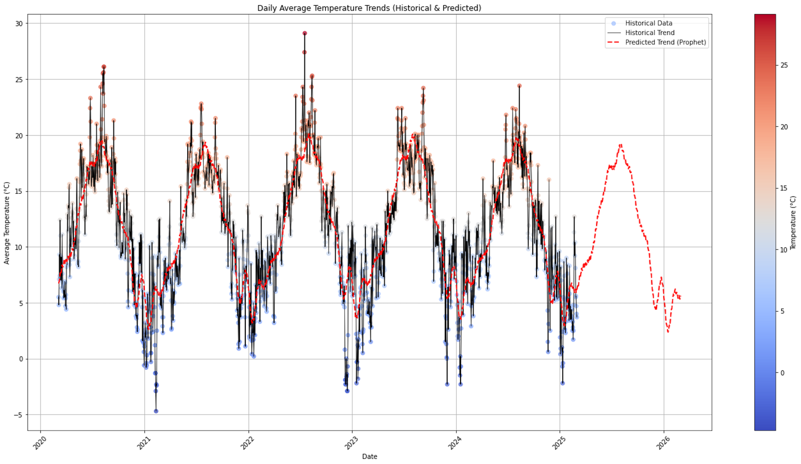</td>
    <td><a href="https://github.com/sitshayeva/portfolio/tree/main/projects/55">Project</a></td>
  </tr>
  <tr>
    <td><strong>UK Online Retail Data Quality Validation Project (GX)</strong></td>
    <td></td>
    <td><a href="https://github.com/sitshayeva/portfolio/tree/main/projects/51">Project</a></td>
  </tr>
  <tr>
    <td><strong>Toy Store KPI Report</strong></td>
    <td>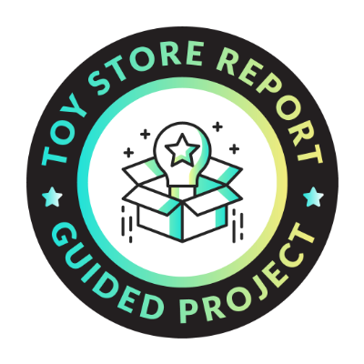</td>
    <td><a href="https://github.com/sitshayeva/portfolio/tree/main/projects/47">Project</a></td>
  </tr>
  <tr>
    <td><strong>Global CO2 Emissions Interactive Dashboard</strong></td>
    <td>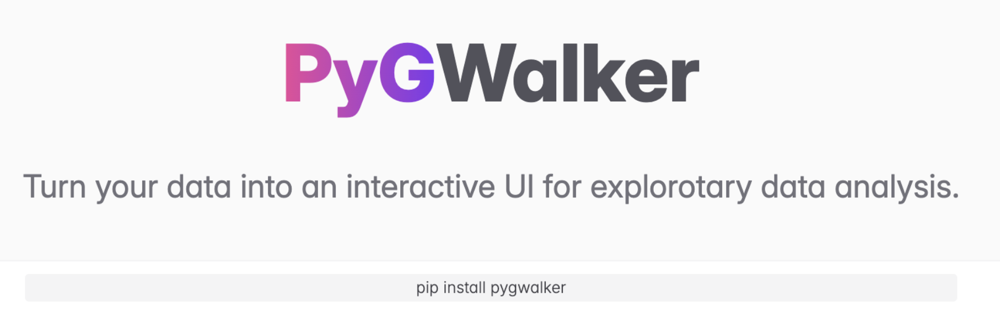</td>
    <td><a href="https://github.com/sitshayeva/portfolio/tree/main/projects/52">Project</a></td>
  </tr>
  <tr>
    <td><strong>LEGO Set Explorer</strong></td>
    <td></td>
    <td><a href="https://github.com/sitshayeva/portfolio/tree/main/projects/48">Project</a></td>
  </tr>
  <tr>
    <td><strong>Coffee Shop Dashboard</strong></td>
    <td>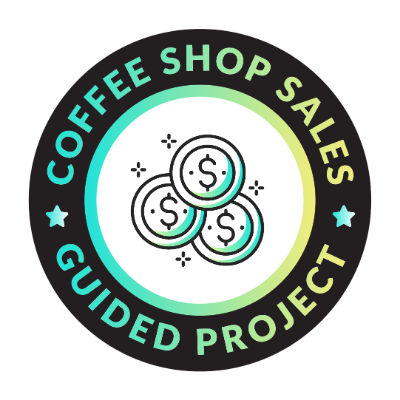</td>
    <td><a href="https://github.com/sitshayeva/portfolio/tree/main/projects/49">Project</a></td>
  </tr>
  <tr>
    <td><strong>Global CO2 Emissions</strong></td>
    <td></td>
    <td><a href="https://github.com/sitshayeva/portfolio/tree/main/projects/50">Project</a></td>
  </tr>
  <tr>
    <td><strong>AirBnB Listing Analysis</strong></td>
    <td></td>
    <td><a href="https://github.com/sitshayeva/portfolio/tree/main/projects/44">Project</a></td>
  </tr>
<table>
  <tr>
    <td><strong>Restaurant Order Analysis</strong></td>
    <td></td>
    <td><a href="https://github.com/sitshayeva/portfolio/tree/main/projects/45">Project</a></td>
  </tr>
  <tr>
    <td><strong>CRM Sales Dashboard</strong></td>
    <td></td>
    <td><a href="https://github.com/sitshayeva/portfolio/tree/main/projects/46">Project</a></td>
  </tr>
  <tr>
    <td><strong>Market Basket Analysis</strong></td>
    <td></td>
    <td><a href="https://github.com/sitshayeva/portfolio/tree/main/projects/43">Project</a></td>
  </tr>
  <tr>
    <td><strong>PySpark Diabetes Prediction ML Project</strong></td>
    <td>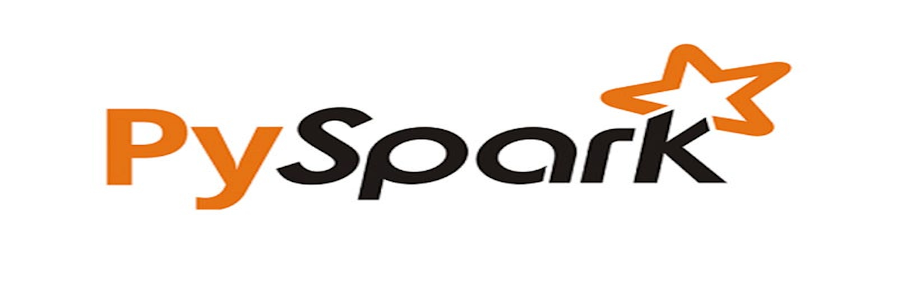</td>
    <td><a href="https://github.com/sitshayeva/portfolio/tree/main/projects/42">Project</a></td>
  </tr>
  <tr>
    <td><strong>iTunes Podcast Reviews Dashboards Tableau</strong></td>
    <td>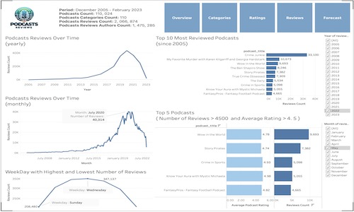</td>
    <td><a href="https://github.com/sitshayeva/portfolio/tree/main/projects/41">Project</a></td>
  </tr>
  <tr>
    <td><strong>Customer K-means clustering in Python</strong></td>
    <td>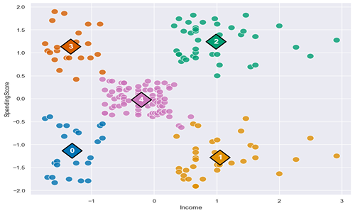</td>
    <td><a href="https://github.com/sitshayeva/portfolio/tree/main/projects/30">Project</a></td>
  </tr>
  <tr>
    <td><strong>Machine Learning: Decision Tree with KNIME</strong></td>
    <td> 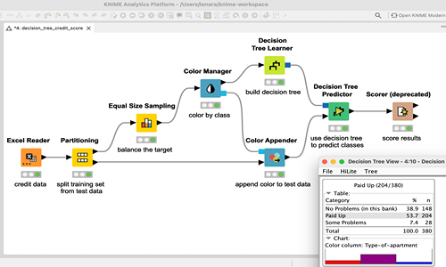</td>
    <td><a href="https://github.com/sitshayeva/portfolio/tree/main/projects/31">Project</a></td>
  </tr>
  <tr>
    <td><strong>NLP Challenge: IMDB Dataset of 50K Movie Reviews Sentiment Analysis</strong></td>
    <td>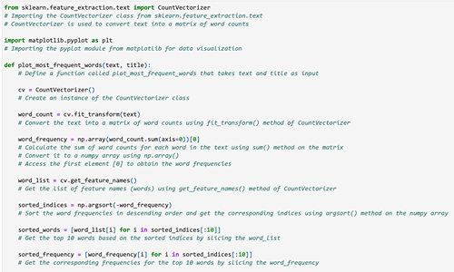</td>
    <td><a href="https://github.com/sitshayeva/portfolio/tree/main/projects/32">Project</a></td>
  </tr>
  <tr>
    <td><strong>Recommendation System: Collaborative Filtering</strong></td>
    <td>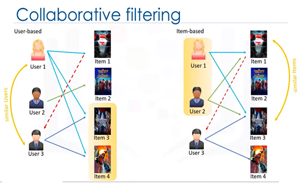</td>
    <td><a href="https://github.com/sitshayeva/portfolio/tree/main/projects/35">Project</a></td>
  </tr>
  <tr>
    <td><strong>Book Recommendation Model: K-Nearest Neighbors</strong></td>
    <td>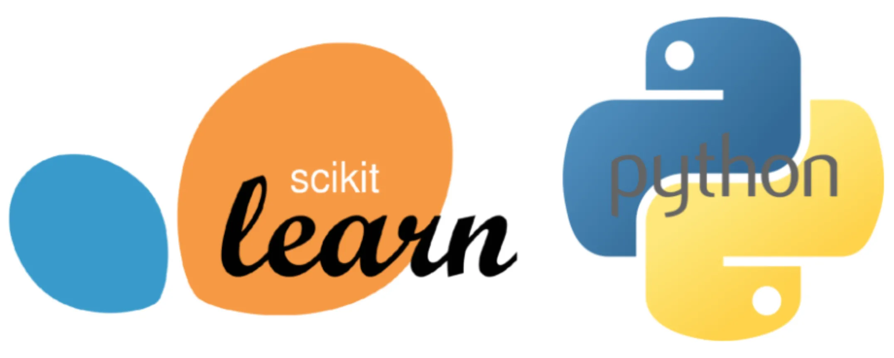</td>
    <td><a href="https://github.com/sitshayeva/portfolio/tree/main/projects/37">Project</a></td>
  </tr>
  <tr>
    <td><strong>Amazon Customer Reviews Sentiment Analysis</strong></td>
    <td>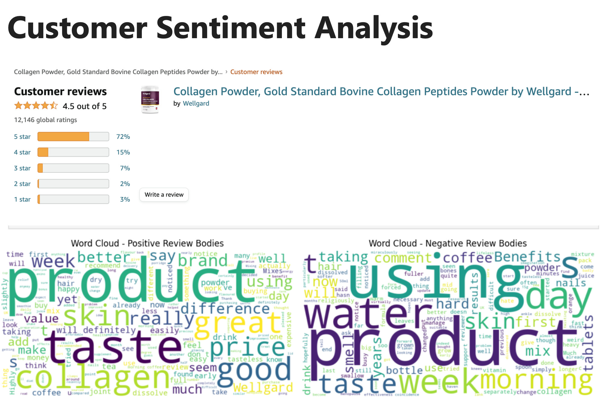</td>
    <td><a href="https://github.com/sitshayeva/portfolio/tree/main/projects/33">Project</a></td>
  </tr>
  <tr>
    <td><strong>Image Classifier using TensorFlow & Keras</strong></td>
    <td>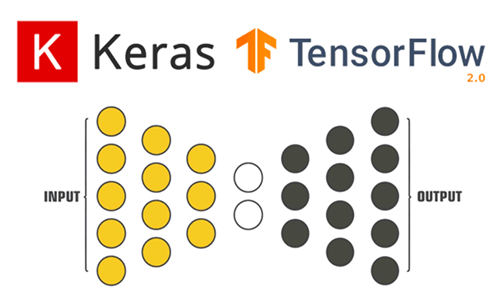</td>
    <td><a href="https://github.com/sitshayeva/portfolio/tree/main/projects/36">Project</a></td>
  </tr>
  <tr>
    <td><strong>Linear Regression Health Costs Calculator</strong></td>
    <td>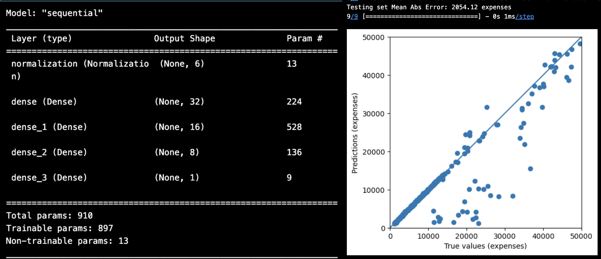</td>
    <td><a href="https://github.com/sitshayeva/portfolio/tree/main/projects/38">Project</a></td>
  </tr>
  <tr>
    <td><strong>Neural Network SMS Text Classifier</strong></td>
    <td>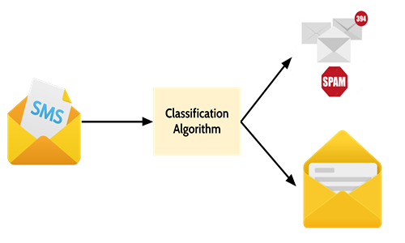</td>
    <td><a href="https://github.com/sitshayeva/portfolio/tree/main/projects/39">Project</a></td>
  </tr>
  <tr>
    <td><strong>Sentiment Analysis of Yelp Business Reviews</strong></td>
    <td>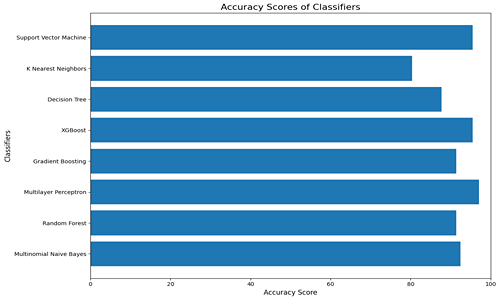</td>
    <td><a href="https://github.com/sitshayeva/portfolio/tree/main/projects/15">Project</a></td>
  </tr>
<table>
  <tr>
    <td><strong>Using Streamlit for Data Visualisation</strong></td>
    <td> 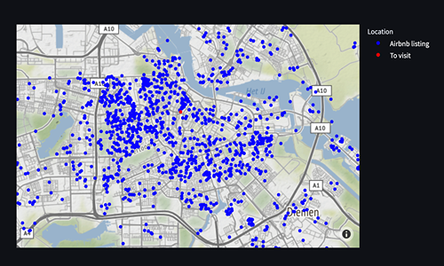</td>
    <td><a href="https://github.com/sitshayeva/portfolio/tree/main/projects/18">Project</a></td>
  </tr>
  <tr>
    <td><strong>WEB Scraping and Sentiment Analysis British Airways Customer Reviews</strong></td>
    <td>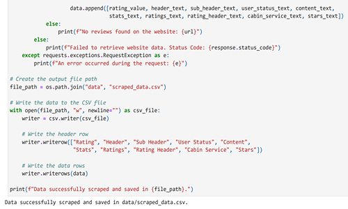 </td>
    <td><a href="https://github.com/sitshayeva/portfolio/tree/main/projects/24">Project</a></td>
  </tr>
  <tr>
    <td><strong>Creating Dynamic Filters in Streamlit</strong></td>
    <td> 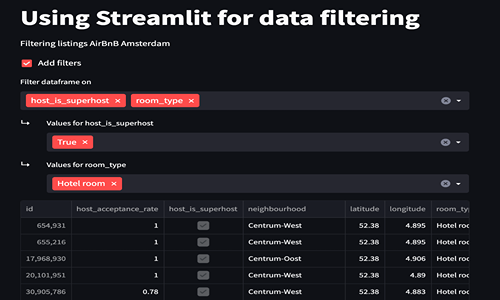</td>
    <td><a href="https://github.com/sitshayeva/portfolio/tree/main/projects/19">Project</a></td>
  </tr>
  <tr>
    <td><strong>Predicting Customer Behaviour British Airways</strong></td>
    <td>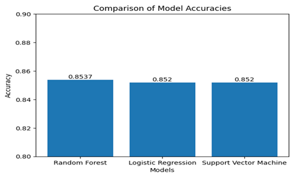 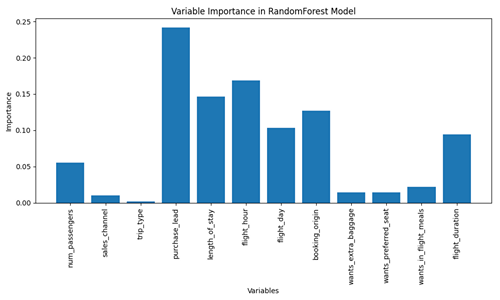</td>
    <td><a href="https://github.com/sitshayeva/portfolio/tree/main/projects/25">Project</a></td>
  </tr>
  <tr>
    <td><strong>Kaggle Housing Prices Competition</strong></td>
    <td>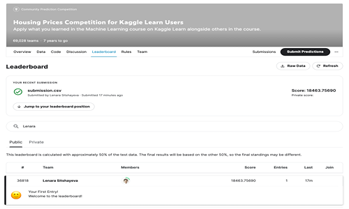</td>
    <td><a href="https://github.com/sitshayeva/portfolio/tree/main/projects/28">Project</a></td>
  </tr>
  <tr>
    <td><strong>Kaggle Store Sales - Time Series Forecasting</strong></td>
    <td>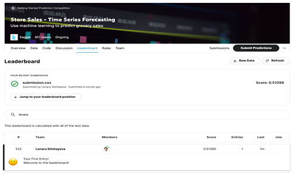</td>
    <td><a href="https://github.com/sitshayeva/portfolio/tree/main/projects/34">Project</a></td>
  </tr>
  <tr>
    <td><strong>Supervised ML: Regression Tree in Python</strong></td>
    <td>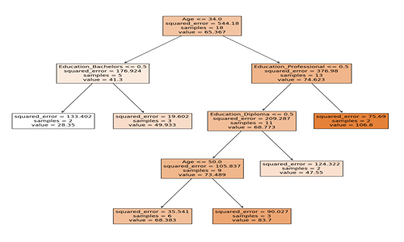</td>
    <td><a href="https://github.com/sitshayeva/portfolio/tree/main/projects/29">Project</a></td>
  </tr>
  <tr>
    <td><strong>Credit Card Fraud Detection using Scikit-Learn and Snap ML</strong></td>
    <td> 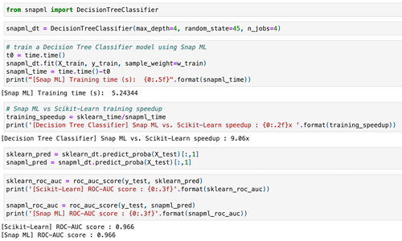</td>
    <td><a href="https://github.com/sitshayeva/portfolio/tree/main/projects/22">Project</a></td>
  </tr>
  <tr>
    <td><strong>Natural Language Processing with Hugging Face Transformers</strong></td>
    <td>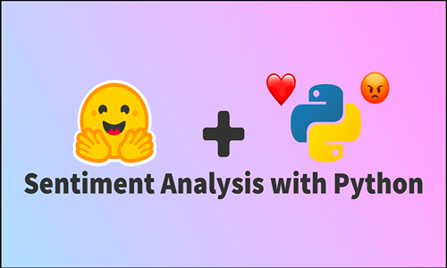 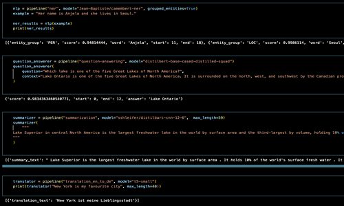</td>
    <td><a href="https://github.com/sitshayeva/portfolio/tree/main/projects/23">Project</a></td>
  </tr>
  <tr>
    <td><strong>Auto Exploratory Data Analysis with D-Tale, SweetViz, Pandas Profiling</strong></td>
    <td>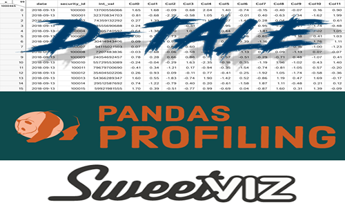</td>
    <td><a href="https://github.com/sitshayeva/portfolio/tree/main/projects/26">Project</a></td>
  </tr>
  <tr>
    <td><strong>Auto ML and Bespoke ML with sklearn (Random Forest, Logistic Regression, SVC)</strong></td>
    <td>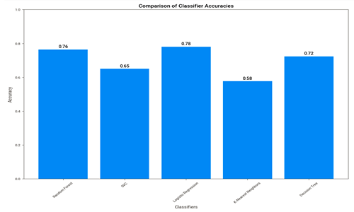</td>
    <td><a href="https://github.com/sitshayeva/portfolio/tree/main/projects/27">Project</a></td>
  </tr>
  <tr>
    <td><strong>Assess the Quality of a Dataset for a Public Service Agency</strong></td>
    <td>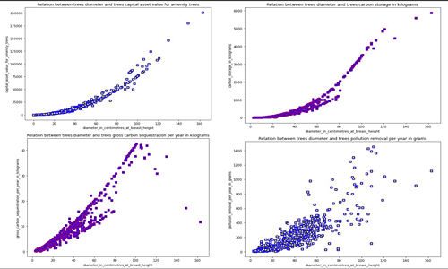</td>
    <td><a href="https://github.com/sitshayeva/portfolio/tree/main/projects/4">Project</a></td>
  </tr>
  <tr>
    <td><strong>Data Transformation Pipeline with Cloud Dataprep (Alteryx)</strong></td>
    <td>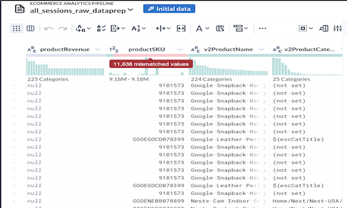</td>
    <td><a href="https://github.com/sitshayeva/portfolio/tree/main/projects/40">Project</a></td>
  </tr>
  <tr>
    <td><strong>Correlation in Python</strong></td>
    <td>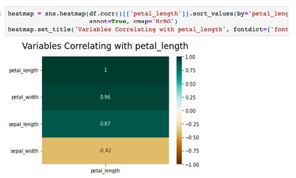</td>
    <td><a href="https://github.com/sitshayeva/portfolio/tree/main/projects/20">Project</a></td>
  </tr>
  <tr>
    <td><strong>Explore Data Using SQL in Google Colab</strong></td>
    <td>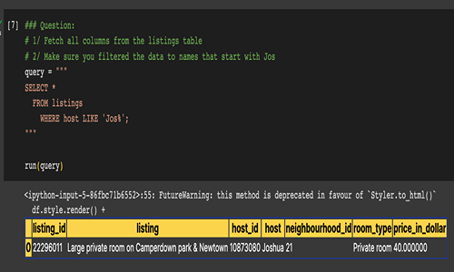</td>
    <td><a href="https://github.com/sitshayeva/portfolio/tree/main/projects/17">Project</a></td>
  </tr>
  <tr>
    <td><strong>SQL Sub-queries in Google Colab</strong></td>
    <td>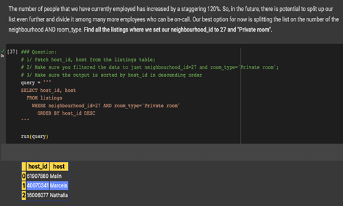</td>
    <td><a href="https://github.com/sitshayeva/portfolio/tree/main/projects/16">Project</a></td>
  </tr>
  <tr>
    <td><strong>Create a Dashboard Meeting Business Requirements</strong></td>
    <td>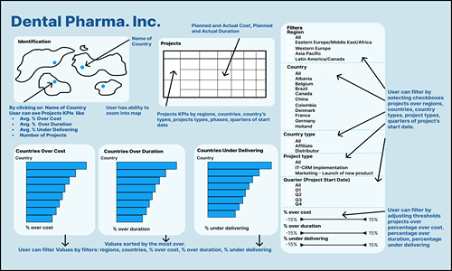</td>
    <td><a href="https://github.com/sitshayeva/portfolio/tree/main/projects/6">Project</a></td>
  </tr>
  <tr>
    <td><strong>Retrieve User Activity Data on an Online Forum Using SQL</strong></td>
    <td>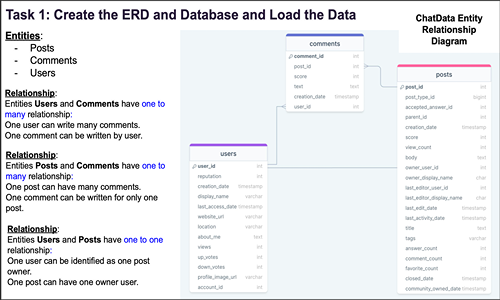</td>
    <td><a href="https://github.com/sitshayeva/portfolio/tree/main/projects/7">Project</a></td>
  </tr>
  <tr>
    <td><strong>Working with Web APIs and JSON on Movies Dataset</strong></td>
    <td>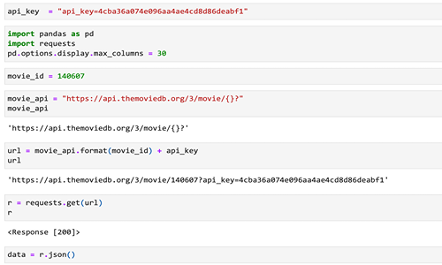</td>
    <td><a href="https://github.com/sitshayeva/portfolio/tree/main/projects/2">Project</a></td>
  </tr>
  <tr>
    <td><strong>Explore a Dataset on Energy Usage and Draw First Conclusions</strong></td>
    <td>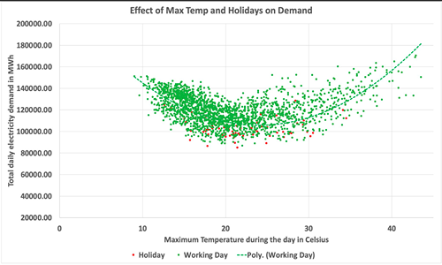</td>
    <td><a href="https://github.com/sitshayeva/portfolio/tree/main/projects/5">Project</a></td>
  </tr>
  <tr>
    <td><strong>Create a Web Server and an Amazon RDS DB Instance</strong></td>
    <td>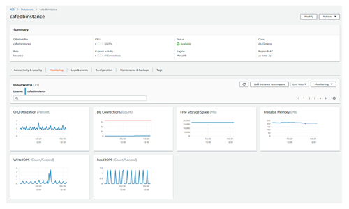</td>
    <td><a href="https://github.com/sitshayeva/portfolio/tree/main/projects/3">Project</a></td>
  </tr>
<table>
  <tr>
    <td><strong>Data Analysis using Pandas and SQLite3</strong></td>
    <td>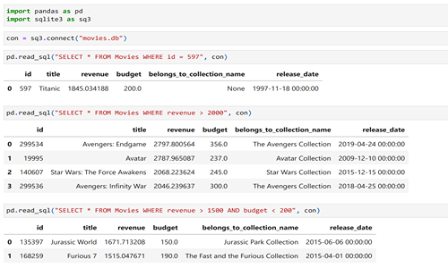</td>
    <td><a href="https://github.com/sitshayeva/portfolio/tree/main/projects/14">Project</a></td>
  </tr>
  <tr>
    <td><strong>E-commerce Store Sales Analysis</strong></td>
    <td>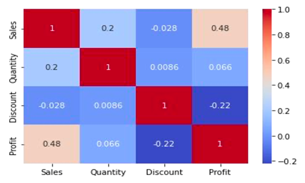</td>
    <td><a href="https://github.com/sitshayeva/portfolio/tree/main/projects/8">Project</a></td>
  </tr>
  <tr>
    <td><strong>Exploratory Data Analysis on Diamonds Dataset</strong></td>
    <td>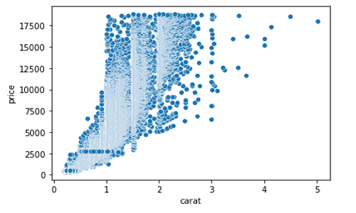</td>
    <td><a href="https://github.com/sitshayeva/portfolio/tree/main/projects/9">Project</a></td>
  </tr>
  <tr>
    <td><strong>Data Cleaning, Transformation, and Visualisation on AirBnB London Dataset</strong></td>
    <td>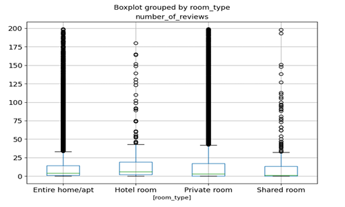</td>
    <td><a href="https://github.com/sitshayeva/portfolio/tree/main/projects/12">Project</a></td>
  </tr>
  <tr>
    <td><strong>Data Cleaning on Movies Dataset</strong></td>
    <td>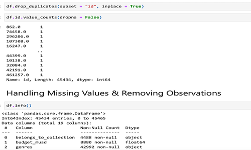</td>
    <td><a href="https://github.com/sitshayeva/portfolio/tree/main/projects/10">Project</a></td>
  </tr>
  <tr>
    <td><strong>Short-Term Rental Analytics on AirBnB Bristol Dataset</strong></td>
    <td>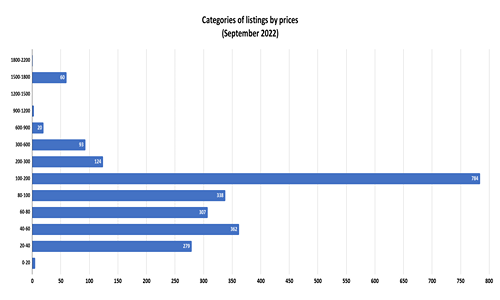</td>
    <td><a href="https://github.com/sitshayeva/portfolio/tree/main/projects/11">Project</a></td>
  </tr>
  <tr>
    <td><strong>Data Cleaning, Merging, Transforming on Movies Dataset</strong></td>
    <td>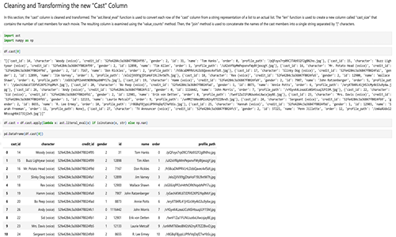</td>
    <td><a href="https://github.com/sitshayeva/portfolio/tree/main/projects/13">Project</a></td>
  </tr>
  <tr>
    <td><strong>Exploratory Data Analysis on Movies Dataset</strong></td>
    <td>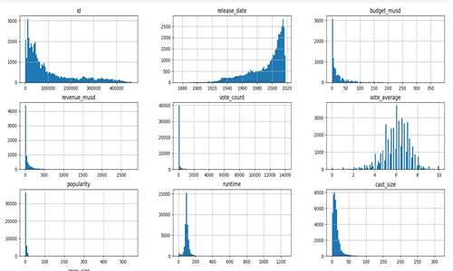</td>
    <td><a href="https://github.com/sitshayeva/portfolio/tree/main/projects/1">Project</a></td>
  </tr>
</table>
